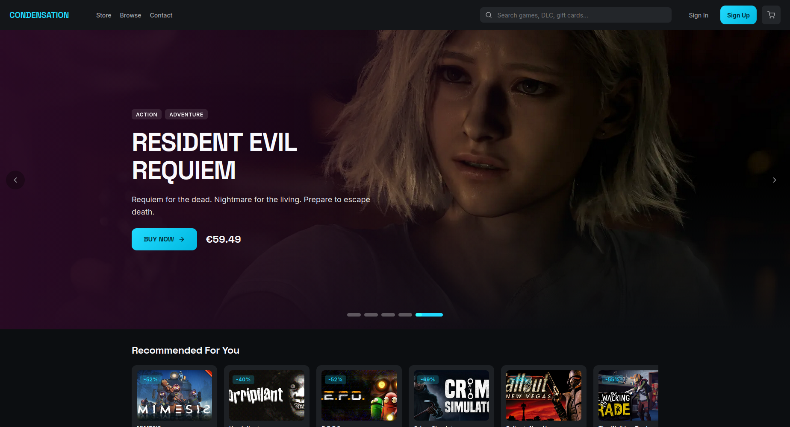
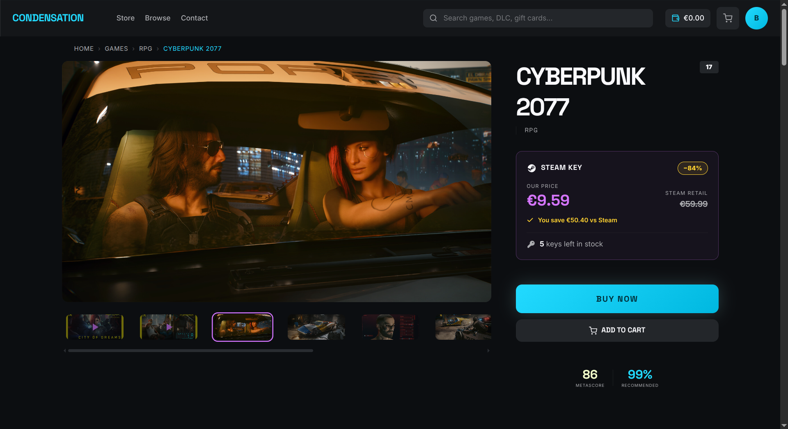
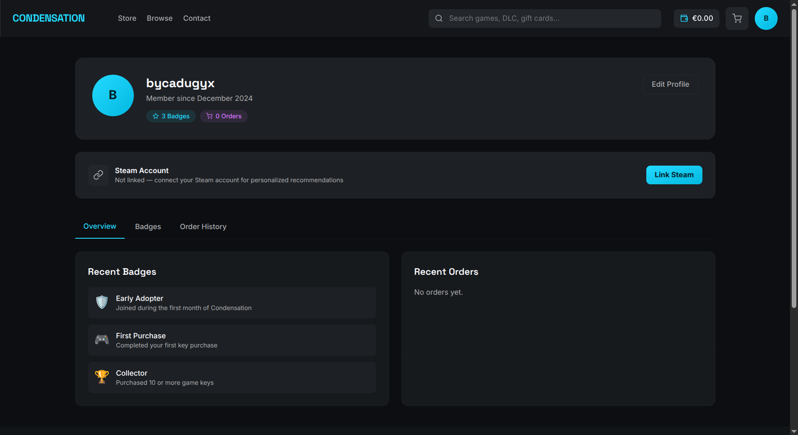
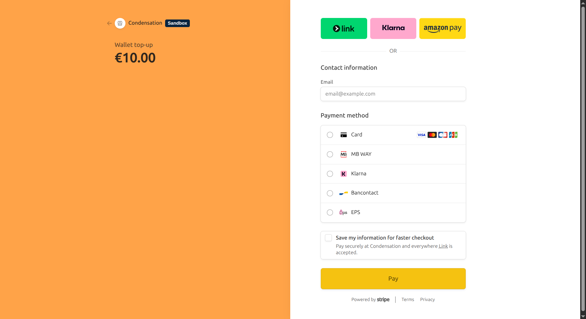
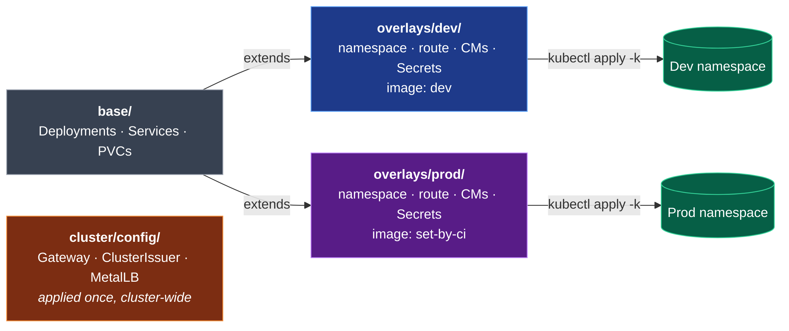

# Condensation — Technical Documentation

Condensation is a game key marketplace (think CDKeys / Green Man Gaming) where users can browse a catalog of games, top up a wallet via Stripe, and purchase Steam keys delivered instantly.

## Table of Contents

- [UI Overview](#ui-overview)
- [Team](#team)
- [Architecture Overview](#architecture-overview)
- [Services](#services)
  - [Frontend](#frontend-nextjs)
  - [Authentication Service](#authentication-service-laravel--passport)
  - [Backend Service](#backend-service-spring-boot)
  - [Databases](#databases)
  - [Kafka](#kafka)
- [Authentication Flow](#authentication-flow)
- [Backend API Reference](#backend-api-reference)
- [Kubernetes Cluster](#kubernetes-cluster)
  - [Cluster Components](#cluster-components)
  - [Kustomize Structure](#kustomize-structure)
  - [Environments](#environments)
  - [Routing](#routing)
  - [TLS & Certificates](#tls--certificates)
  - [Persistent Storage](#persistent-storage)
- [Local Development](#local-development)

---

## UI Overview

### Home — Game Store



The store front features a hero banner with featured games, curated sections (Top Sellers, New Releases, Deals), and a global search bar.

### Sign In


Authentication is handled by the dedicated Laravel/Passport service. Users are redirected to the auth service via the OAuth2 PKCE flow before being returned to the frontend with a session token.

### Game Detail Page



Each game page shows screenshots, trailer links, genre tags, pricing, the discount versus Steam retail price, and a real-time key count. Users can add to cart or buy immediately.

### Profile & Order History



The profile page displays the user's wallet balance, badge collection, and complete order history. Steam account linking is available for personalised recommendations.

### Stripe Wallet Top-Up



Wallet top-ups go through a Stripe Checkout session. The frontend creates the session server-side and redirects the user. On success a Stripe webhook calls the backend's internal balance endpoint to credit the account.

---

## Team

| Member | Scope |
|---|---|
| Corentin Dupaigne | Infrastructure (`/infra`), authentication service (`/authentication`) |
| Jules Ladaigue | Java backend services (`/backend`) |
| Nhat Linh Nguyen | Next.js frontend (`/frontend`) |
| Adrien Deu | Frontend (`/frontend`) |

---

## Architecture Overview

```
                          Internet
                              │
                    ┌─────────▼─────────┐
                    │   Envoy Gateway   │  ← MetalLB LoadBalancer
                    │  (GatewayAPI v1)  │    54.38.190.139
                    └─────┬───────┬─────┘
               /login     │       │   /
               /register  │       │   (everything else)
               /oauth      │       │
               /auth       │       │
                    ┌──────▼──┐ ┌──▼──────────┐
                    │  Auth   │ │  Frontend   │
                    │ (Laravel│ │  (Next.js)  │
                    │Passport)│ │  :3000      │
                    └────┬────┘ └──────┬──────┘
                         │             │ /api/* (server-side)
                         │     ┌───────▼───────┐
                         │     │    Backend    │
                         │     │ (Spring Boot) │
                         │     │    :8080      │
                         │     └───┬──────┬────┘
                         │         │      │
                    ┌────▼────┐ ┌──▼──┐ ┌▼───────────┐
                    │postgres │ │game │ │   Kafka     │
                    │(auth_db)│ │ DB  │ │(catalog-logs│
                    │  :5432  │ │:5432│ │   topic)    │
                    └─────────┘ └─────┘ └────────────┘
```

All services run inside a **k3s single-node cluster** on an OVH VPS. Traffic enters via a single MetalLB-assigned IP, is terminated at the Envoy Gateway (TLS via Let's Encrypt), and is path-routed to the correct namespace and service.

---

## Services

### Frontend (Next.js)

| | |
|---|---|
| **Runtime** | Next.js 15 · TypeScript · Bun |
| **Port** | 3000 |
| **Image** | `ghcr.io/corentin-dupaigne/fullstack_project/frontend` |

The frontend is a server-rendered Next.js application. It communicates with the auth service using the OAuth2 PKCE flow and calls the backend Spring Boot API from server-side route handlers. Stripe Checkout sessions are also created server-side, keeping the secret key off the browser.

Key environment variables:

| Variable | Purpose |
|---|---|
| `AUTH_URL` | Public URL of the auth service (used for browser redirects) |
| `API_URL` | Internal URL of the auth service (used for server-side token introspection) |
| `BACKEND_URL` | Internal URL of the backend service |
| `CLIENT_ID` | OAuth2 client ID — must match `CLIENT_ID` in auth-cm |
| `REDIRECT_URI` | OAuth2 callback URL |
| `STRIPE_SECRET_KEY` | Stripe secret key (server-side only) |
| `STRIPE_WEBHOOK_SECRET` | Used to verify incoming Stripe webhook signatures |

---

### Authentication Service (Laravel + Passport)

| | |
|---|---|
| **Runtime** | PHP 8.3 · Laravel 11 · Laravel Passport |
| **Port** | 80 |
| **Image** | `ghcr.io/corentin-dupaigne/fullstack_project/auth` |
| **Database** | PostgreSQL `auth_db` |

Implements the full **OAuth2 Authorization Code + PKCE** flow using Laravel Passport. The service is the sole source of truth for user identities and access tokens.

**Key routes:**

| Route | Description |
|---|---|
| `GET /auth/oauth-init` | Clears existing session then forwards to `/oauth/authorize` — prevents silent re-auth with stale sessions |
| `GET /auth/logout` | Invalidates the web session and redirects to the frontend |
| `GET /api/user` | Returns the authenticated user's profile (requires Bearer token) |
| `GET /api/auth/validate` | Token introspection endpoint — used by the backend to validate incoming requests |
| `POST /api/auth/token/revoke` | Revokes the current access token and its refresh token |
| `GET /oauth/authorize` | Standard OAuth2 authorization endpoint (Passport) |
| `POST /oauth/token` | Token issuance endpoint (Passport) |

The `CLIENT_ID` is generated once by running `php artisan passport:client --personal` inside the auth pod and must be kept in sync between `auth-cm` and `frontend-cm`.

---

### Backend Service (Spring Boot)

| | |
|---|---|
| **Runtime** | Java 17 · Spring Boot 4.0.4 |
| **Port** | 8080 |
| **Image** | `ghcr.io/corentin-dupaigne/fullstack_project/backend` |
| **Database** | PostgreSQL `game_db` (custom image with seed data) |

The backend is a single Spring Boot application providing the game catalog, order management, and wallet APIs. It validates OAuth2 tokens on every protected request by calling `/api/auth/validate` on the auth service (token introspection via `AuthServiceIntrospector`).

**AOP-based Kafka logging**: every public service method is intercepted by `KafkaLoggingAspect`, which serialises the method name, parameters, and return value to JSON and publishes it to the `catalog-logs` Kafka topic.

---

### Databases

| Service | Image | Database | PVC Size | Purpose |
|---|---|---|---|---|
| `postgres` | `postgres` (official) | `auth_db` | 2 Gi | User accounts, OAuth tokens, sessions |
| `postgres-game` | `ghcr.io/.../postgres-game` | `game_db` | 5 Gi | Game catalog, orders, balances, Steam keys |

`postgres-game` uses a custom image that includes the initial seed data (games, screenshots, genres, etc.) so the catalog is populated on first start.

Both databases use k3s `local-path` PersistentVolumeClaims, meaning data is stored on the node's local disk.

---

### Kafka

| | |
|---|---|
| **Image** | `apache/kafka:3.7.0` |
| **Mode** | KRaft (combined broker + controller, no Zookeeper) |
| **Listeners** | `PLAINTEXT://0.0.0.0:9092` (broker), `CONTROLLER://0.0.0.0:9093` (controller) |
| **Topic** | `catalog-logs` |

Kafka is used solely for structured audit logging. The `KafkaLoggingAspect` in the backend publishes a JSON event to `catalog-logs` after every service call, including timestamp, class/method name, parameters, and result type. Replication factor is 1 (single-node cluster).

---

## Authentication Flow

```
Browser                Frontend (Next.js)       Auth Service (Laravel)
   │                         │                          │
   │  GET /                  │                          │
   │────────────────────────►│                          │
   │  302 → /auth/oauth-init │                          │
   │◄────────────────────────│                          │
   │                         │                          │
   │  GET /auth/oauth-init?client_id=...&code_challenge=...
   │────────────────────────────────────────────────────►│
   │  (session cleared) 302 → /oauth/authorize          │
   │◄────────────────────────────────────────────────────│
   │                         │                          │
   │  GET /oauth/authorize   │                          │
   │────────────────────────────────────────────────────►│
   │  Login page rendered                               │
   │◄────────────────────────────────────────────────────│
   │                         │                          │
   │  POST credentials       │                          │
   │────────────────────────────────────────────────────►│
   │  302 → REDIRECT_URI?code=...                       │
   │◄────────────────────────────────────────────────────│
   │                         │                          │
   │  GET /api/auth/callback?code=...                   │
   │────────────────────────►│                          │
   │                         │  POST /oauth/token       │
   │                         │  (code + code_verifier)  │
   │                         │─────────────────────────►│
   │                         │  { access_token, ... }   │
   │                         │◄─────────────────────────│
   │  Session cookie set     │                          │
   │◄────────────────────────│                          │
```

On subsequent authenticated requests the frontend sends the `Authorization: Bearer <token>` header to the backend, which calls `/api/auth/validate` on the auth service to verify the token before serving the response.

---

## Backend API Reference

### Public endpoints (no auth required)

| Method | Path | Description |
|---|---|---|
| `GET` | `/api/games` | Paginated game catalog — supports `search` and `genreId` query params |
| `GET` | `/api/games/{id}` | Full game detail with screenshots, genres, companies |
| `GET` | `/api/games/{id}/key_counts` | Available Steam key count for a game |
| `GET` | `/api/feature` | Featured game sections (top sellers, new releases, deals under €5/€10/€20) |

### Authenticated user endpoints (Bearer token required)

| Method | Path | Description |
|---|---|---|
| `GET` | `/api/user` | Proxy to the auth service — returns the current user's profile |
| `GET` | `/api/orders` | List all orders for the authenticated user |
| `GET` | `/api/orders/{id}` | Order detail |
| `POST` | `/api/orders` | Create a new order (deducts balance, delivers Steam keys) |
| `GET` | `/api/balance` | Get current wallet balance |
| `POST` | `/api/balance` | Top up wallet balance |

### Internal endpoints (X-Internal-Secret header)

Called from within the cluster (e.g. the frontend's Stripe webhook handler). Authenticated via a shared secret, not OAuth.

| Method | Path | Description |
|---|---|---|
| `POST` | `/api/internal/orders` | Create an order on behalf of a user ID |
| `POST` | `/api/internal/balance` | Credit/debit a user's balance (used after Stripe payment confirmation) |

### Admin endpoints (admin role required)

| Method | Path | Description |
|---|---|---|
| `GET/POST/DELETE` | `/api/admin/games` | Manage the game catalog |
| `GET/PATCH` | `/api/admin/orders` | View and update all orders |
| `GET` | `/api/admin/users` | List all users |

---

## Kubernetes Cluster

### Cluster Components

| Component | Role |
|---|---|
| **k3s** | Lightweight Kubernetes distribution — single-node on OVH VPS |
| **Envoy Gateway** | Kubernetes Gateway API implementation — handles HTTP/HTTPS routing |
| **MetalLB** | Assigns a real LoadBalancer IP (`54.38.190.139`) to the Envoy Gateway Service |
| **cert-manager** | Automates TLS certificate issuance and renewal via Let's Encrypt ACME (HTTP-01) |
| **local-path** | k3s built-in storage provisioner — backs all PersistentVolumeClaims |
| **GHCR** | GitHub Container Registry — stores all service images |

### Kustomize Structure

```
infra/kubernetes/
├── base/                        # Shared, environment-agnostic manifests
│   ├── deployments/             # Deployment for each service
│   ├── services/                # ClusterIP Service for each deployment
│   └── pvcs/                    # PersistentVolumeClaims
│
├── overlays/
│   ├── dev/                     # dev namespace overlay
│   │   ├── namespace.yaml
│   │   ├── http-route.yaml      # Routes dev.condensation.corentindupaigne.com
│   │   ├── configmaps/          # Per-environment ConfigMaps
│   │   └── secrets/             # Per-environment Secrets (not committed)
│   │
│   └── prod/                    # prod namespace overlay
│       ├── namespace.yaml
│       ├── http-route.yaml      # Routes condensation.corentindupaigne.com
│       ├── configmaps/
│       └── secrets/
│
└── cluster/
    └── config/                  # Cluster-wide resources (applied once)
        ├── gateway-class.yaml   # Envoy GatewayClass
        ├── gateway.yaml         # Gateway — HTTP+HTTPS listeners for both envs
        ├── cert-manager.yaml    # ClusterIssuer + Certificate resources
        ├── metallb-config.yaml  # IPAddressPool + L2Advertisement
        └── http-redirect-route.yaml  # HTTP→HTTPS 301 redirects
```



**Deploy commands:**

```bash
# Apply cluster-wide infrastructure (once)
kubectl apply -k infra/kubernetes/cluster/config/

# Deploy to the dev environment
kubectl apply -k infra/kubernetes/overlays/dev/

# Deploy to production (CI sets image tags before applying)
kubectl apply -k infra/kubernetes/overlays/prod/
```

Image tags in `overlays/prod/kustomization.yaml` are set by CI at deploy time using `kustomize edit set image`. Do not apply the prod overlay manually without first setting the correct tags.

### Environments

| Environment | Namespace | Hostname | Image Tag |
|---|---|---|---|
| Development | `dev` | `dev.condensation.corentindupaigne.com` | `dev` (built on every push) |
| Production | `prod` | `condensation.corentindupaigne.com` | date-stamped (`YYYYMMDD-HHMM`), set by CI |

Both environments run identical workloads from the same base manifests. Environment-specific config (URLs, log levels, debug flags) is injected via ConfigMaps in each overlay.

### Routing

The Envoy Gateway listens on ports 80 and 443 for both hostnames. HTTP requests are immediately redirected to HTTPS (301). HTTPS traffic is path-routed as follows:

| Path prefix | Backend | Port |
|---|---|---|
| `/login` | `auth-svc` | 80 |
| `/register` | `auth-svc` | 80 |
| `/oauth` | `auth-svc` | 80 |
| `/auth` | `auth-svc` | 80 |
| `/pgadmin` | `pgadmin-svc` | 80 |
| `/` (catch-all) | `frontend-svc` | 3000 |

The backend service is **not** exposed through the gateway. It is reachable only within the cluster via its ClusterIP service (`backend-svc:8080`), called server-side by the Next.js frontend.

### TLS & Certificates

cert-manager is configured with a `letsencrypt-prod` ClusterIssuer using the ACME HTTP-01 challenge solver via the Gateway API (`GatewayHTTPRoute`). Two certificates are issued:

| Secret | Domain |
|---|---|
| `dev-condensation-tls` | `dev.condensation.corentindupaigne.com` |
| `prod-condensation-tls` | `condensation.corentindupaigne.com` |

Certificates are automatically renewed by cert-manager before expiry.

### Persistent Storage

All stateful services use k3s `local-path` PersistentVolumeClaims backed by the node's local filesystem.

| PVC | Size | Used by |
|---|---|---|
| `postgres-pvc` | 2 Gi | Auth database (`auth_db`) |
| `postgres-game-pvc` | 5 Gi | Game database (`game_db`) |
| `auth-pvc` | 1 Gi | Laravel storage (sessions, cache, logs) |
| `pgadmin-pvc` | 1 Gi | PgAdmin configuration |

---

## Local Development

The full stack can be started locally with Docker Compose:

```bash
docker compose up
```

| Service | Local URL |
|---|---|
| Frontend | http://localhost:4000 |
| Auth service | http://localhost:8000 |
| Backend | http://localhost:8080 |
| PostgreSQL (auth) | localhost:5433 |
| PostgreSQL (game) | localhost:5434 |
| Kafka | localhost:9092 |
| Kafka UI | http://localhost:8082 |

The frontend mounts the source directory for hot-reload. The auth service also mounts the source with `vendor` and `storage` protected via anonymous volumes.

**Stripe environment variables** must be provided in a `.env` file at the project root:

```env
STRIPE_SECRET_KEY=sk_test_...
STRIPE_WEBHOOK_SECRET=whsec_...
NEXT_PUBLIC_STRIPE_PUBLISHABLE_KEY=pk_test_...
INTERNAL_SECRET=webhook-internal-secret
```

**Running E2E tests:**

```bash
docker compose --profile e2e up e2e-tests
```

**Building and pushing images** (tag based on timestamp to support rollbacks):

```bash
TAG=$(date +%Y%m%d-%H%M)
docker build -t ghcr.io/corentin-dupaigne/fullstack_project/<service>:$TAG .
docker push ghcr.io/corentin-dupaigne/fullstack_project/<service>:$TAG
```
